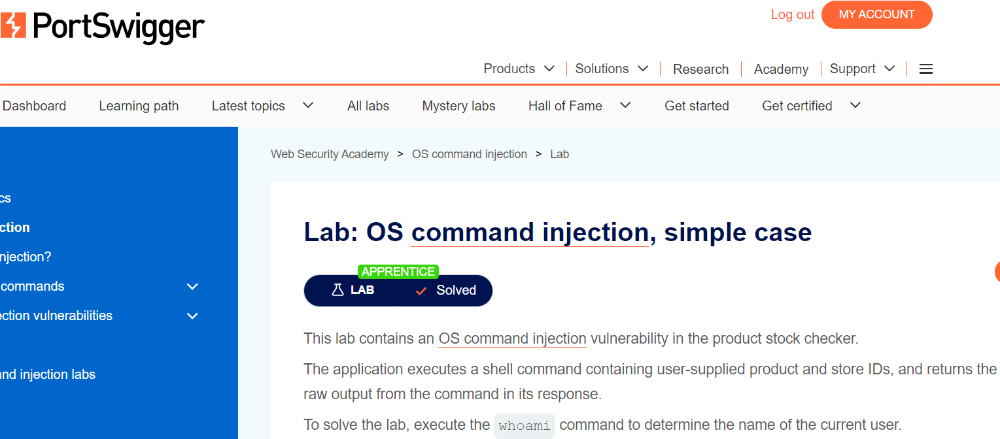

# Injection_de_commande  
### Introduction
L'injection de ligne de commande permet à quelqu'un d'exécuter des commandes système non approuvées sur un serveur Web (pas uniquement un serveur Web). Avec un serveur mal sécurisé, cela donnerait à un attaquant un contrôle complet sur un système.   
  
### Objectifs
✅ Comprendre comment fonctionne un code PHP.  

✅ Comprendre comment fonctionne l'injection de commande dans un serveur Web.  
  
### Challenge  
Screenshot lab solved : https://portswigger.net/web-security/os-command-injection/lab-simple  
(Lien de challenge dans le quête marche pas, donc on fait ce lab pour remplacer le)  
  
